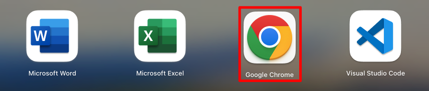
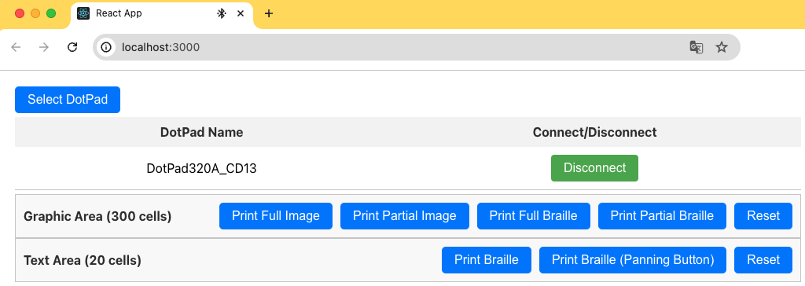
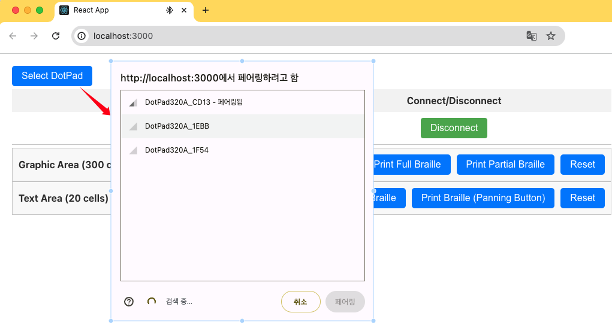

# DotPad SDK Sample Code for Web

## Directory
```
├── DemoApp
│   ├── package.json
└── README.md
```

## Installation
To install the necessary packages for this project, clone or download the project and then run the following command:
```
npm install
```

## How to Run
To start the app in development mode, execute the following command:
```
npm start
```

## Screenshots
1. Launch Chrome web browser (Works only on Chrome browser)  


2. Access the site  


3. Connect DotPad  
