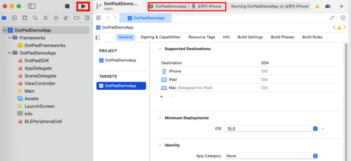

# DotPadSDK 2.0.0 Sample Code for iOS

## Directory
```
├── DemoApp
│   ├── DotPadDemoApp.xcodeproj
│   ├── DotPadDemoApp
│   ├── Framekworks
│   │   ├── BrailleEngine
│   │   ├── DotPadFrameworks.framework
│   │   │   ├── Headers
│   │   │   ├── Modules
│   │   │   └── _CodeSignature
│   └── DotPadDemoApp.xcodeproj
└── README.md
```

## Execution Order
1. Download the source.
2. Run DemoApp/DotPadDemoApp.xcodeproj.
3. Connect your device (iPhone, iPad) to your MacBook.
4. In xcode, specify the target as the connected device and Build.  
        
5. Demo app screen
     
     

## Error action
* Could not find module 'DotPadFrameworks' for target 'arm64-apple-ios-simulator' 
  - In Xcode, you need to set the target to the actual device, not the emulator.

