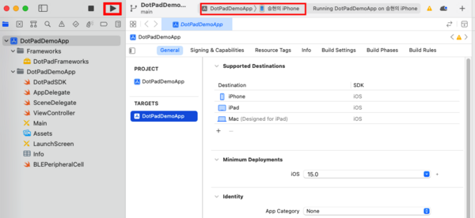
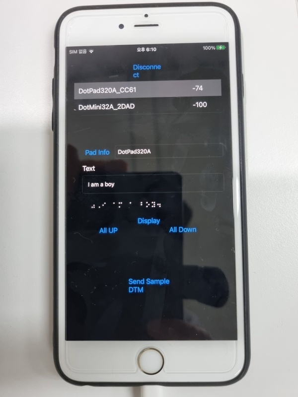
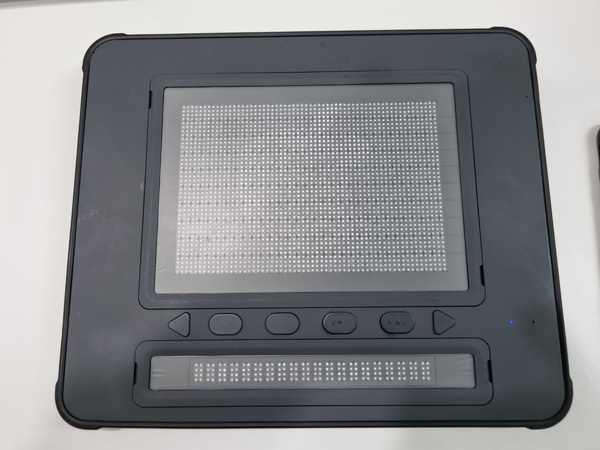

# Sample code for using iOS SDK 2.2.0

## Directory
```
├── DemoApp
│   ├── DotPadDemoApp
│   ├── Framekworks
│   │   ├── BrailleEngine
│   │   ├── DotPadFrameworks.framework
│   └── DotPadDemoApp.xcodeproj
└── README.md
```

## Execution Order
1. Download the source. (dotpad-sample-code/iOS/2.2.0)  
2. Run DemoApp/DotPadDemoApp.xcodeproj.
3. Connect your device (iPhone, iPad) to your MacBook.
4. In xcode, specify the target as the connected device and Build.  
        
5. Demo app screen  
     
     

## Error Resolution
* Module not found error  
  - message : Could not find module 'DotPadFrameworks' for target 'arm64-apple-ios-simulator'   
  - resolution : In Xcode, you need to set the target to the actual device, not the emulator.  
